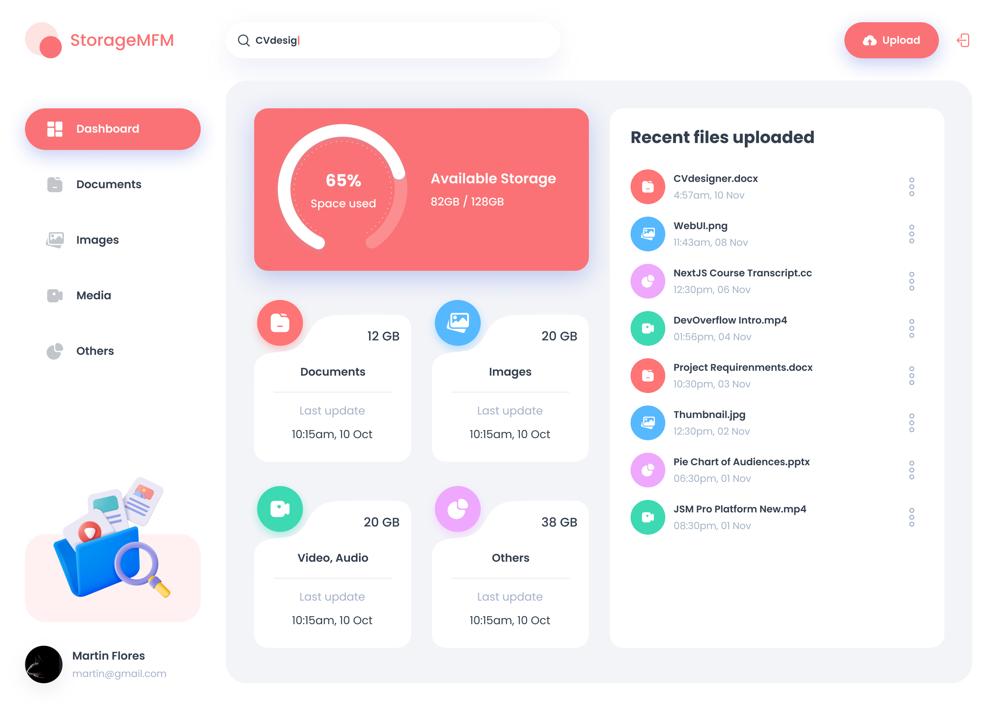

# 📁 Storage MFM - Cloud Storage Platform

> A modern cloud storage solution inspired by Google Drive, built with Next.js and Appwrite.



## 🌟 Features

### 📂 File Management

- **Upload Files**: Drag & drop or browse to upload files of any type
- **File Preview**: View images, documents, and videos directly in the browser
- **File Organization**: Organize files by type (Images, Documents, Videos, Audio, Others)
- **File Actions**: Rename, download, share, and delete files with ease

### 👥 Collaboration & Sharing

- **File Sharing**: Share files with multiple users via email
- **Access Control**: Manage who has access to your files
- **Real-time Updates**: See changes and shared files instantly

### 📊 Analytics & Storage

- **Storage Dashboard**: Visual charts showing storage usage by file type
- **Usage Analytics**: Track your storage consumption with interactive charts
- **File Statistics**: View detailed information about your files

### 🔐 Authentication & Security

- **Secure Authentication**: Email-based authentication with OTP verification
- **Protected Routes**: Secure access to user data and files
- **Session Management**: Automatic session handling and security

## 🛠️ Tech Stack

### Frontend

- **[Next.js 15](https://nextjs.org/)** - React framework with App Router
- **[React 19](https://react.dev/)** - UI library
- **[TypeScript](https://www.typescriptlang.org/)** - Type safety
- **[Tailwind CSS](https://tailwindcss.com/)** - Utility-first CSS framework
- **[Shadcn/ui](https://ui.shadcn.com/)** - Beautiful UI components

### Backend & Database

- **[Appwrite](https://appwrite.io/)** - Backend-as-a-Service
  - Authentication
  - Database
  - File Storage

## 🚀 Getting Started

### Prerequisites

- Node.js 18+
- npm or yarn
- Appwrite account

### Installation

1. **Clone the repository**

   ```bash
   git clone https://github.com/MartinMFM/storageMFM.git
   cd storage_mfm
   ```

2. **Install dependencies**

   ```bash
   npm install
   # or
   yarn install
   ```

3. **Set up environment variables**

   ```bash
   cp .env.example .env.local
   ```

   Fill in your Appwrite credentials in `.env.local`:

   ```env
   NEXT_PUBLIC_APPWRITE_ENDPOINT=https://cloud.appwrite.io/v1
   NEXT_PUBLIC_APPWRITE_PROJECT=your_project_id
   NEXT_PUBLIC_APPWRITE_DATABASE=your_database_id
   NEXT_PUBLIC_APPWRITE_USERS_COLLECTION=your_users_collection_id
   NEXT_PUBLIC_APPWRITE_FILES_COLLECTION=your_files_collection_id
   NEXT_PUBLIC_APPWRITE_BUCKET=your_bucket_id
   NEXT_APPWRITE_KEY=your_secret_key
   ```

4. **Set up Appwrite**

   - Create a new project in [Appwrite Console](https://cloud.appwrite.io/)
   - Create a database and collections for users and files
   - Create a storage bucket for file uploads
   - Configure authentication methods

5. **Run the development server**

   ```bash
   npm run dev
   # or
   yarn dev
   ```

6. **Open your browser**
   Navigate to [http://localhost:3000](http://localhost:3000)

## 📱 Usage

### Authentication

1. **Sign Up**: Create a new account with your email
2. **Verify**: Enter the OTP sent to your email
3. **Sign In**: Access your personal storage dashboard

### File Management

1. **Upload**: Drag files to the upload area or click to browse
2. **Organize**: Files are automatically categorized by type
3. **Manage**: Use the action dropdown for each file to:
   - Rename files
   - Download files
   - Share with others
   - View file details
   - Delete files

### Sharing Files

1. Click the action menu on any file
2. Select "Share"
3. Enter email addresses of people you want to share with
4. Click "Share" to grant access

## 🏗️ Project Structure

```
storage_mfm/
├── app/                    # App Router (Next.js 13+)
│   ├── (auth)/            # Authentication routes
│   ├── (root)/            # Main application routes
│   └── globals.css        # Global styles
├── components/            # Reusable UI components
│   ├── ui/               # Shadcn/ui components
│   └── ...               # Custom components
├── lib/                  # Utility functions and configurations
│   ├── actions/          # Server actions
│   ├── appwrite/         # Appwrite configuration
│   └── utils.ts          # Helper functions
├── public/               # Static assets
├── types/                # TypeScript type definitions
└── constants/            # Application constants
```

## 🔧 Scripts

```bash
# Development
npm run dev          # Start development server with Turbo

# Production
npm run build        # Build for production
npm run start        # Start production server

# Code Quality
npm run lint         # Run ESLint
```

## 🔒 Security Features

- **Email Authentication**: Secure email-based login with OTP
- **File Access Control**: Granular permissions for shared files
- **Secure File Storage**: Files stored securely with Appwrite
- **Session Management**: Automatic session handling and cleanup

## 🤝 Contributing

Contributions are welcome! Please feel free to submit a Pull Request.

1. Fork the project
2. Create your feature branch (`git checkout -b feature/AmazingFeature`)
3. Commit your changes (`git commit -m 'Add some AmazingFeature'`)
4. Push to the branch (`git push origin feature/AmazingFeature`)
5. Open a Pull Request

## 📄 License

This project is licensed under the MIT License - see the [LICENSE](LICENSE) file for details.

## 🙏 Acknowledgments

- [Appwrite](https://appwrite.io/) for the amazing backend services
- [Shadcn/ui](https://ui.shadcn.com/) for the beautiful UI components
- [Next.js](https://nextjs.org/) team for the incredible framework
- [Tailwind CSS](https://tailwindcss.com/) for the utility-first approach

---

<div align="center">
  <p>Built with ❤️ using Next.js and Appwrite</p>
  <p>⭐ Star this repo if you found it helpful!</p>
</div>
